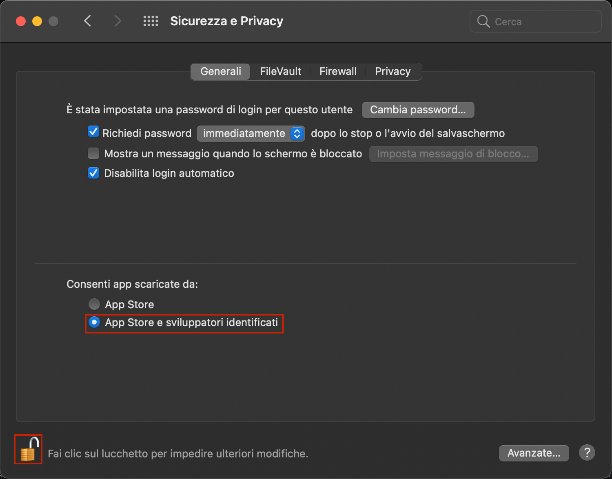
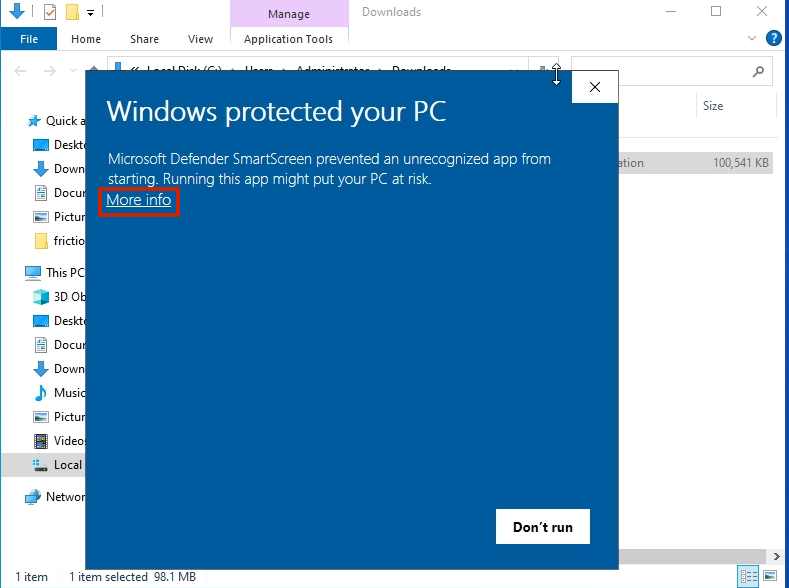

:::tip
In October 2023, **Open Data Editor (v1)** has been released for **early adopters**. Please share your feedback or issues you encouter testing the application! At the moment, it's no recommended to use this software for critical data projects.
:::

Open Data Editor is available on all major platforms:

- Linux
- MacOS
- Windows

You can download and run it without any technical skills. Here are the instructions for all the available platforms:

## Linux

For Linux, there are two options available:

- AppImage (for any distributions)
- deb (for Ubuntu/Debian)

### Any Distribution

Go to the [RELEASES](https://github.com/okfn/opendataeditor/releases) and download the most recent **AppImage** file. After downloading, you have to make it executable:

Then double-click on the file to start the application.

### Ubuntu/Debian

Go to the [RELEASES](https://github.com/okfn/opendataeditor/releases) and download the most recent **DEB** file. Double click on the file and it will initiate the installation process.

After installation, you can use it.

## MacOS

Go to the [RELEASES](https://github.com/okfn/opendataeditor/releases) and download the most recent **DMG** file.

1. If you encounter security message, click on the question mark and then click the link in the first section.

2. Change settings to allow app to execute.

## Windows

Go to the [RELEASES](https://github.com/okfn/opendataeditor/releases) and download the most recent **EXE** file.

1. If you receive the following message click `Continue download`

2. After downloading, double click to run the app. You may encounter the security message window, click `More info` and proceed.

3. Click `Run anyway` to run the application.

